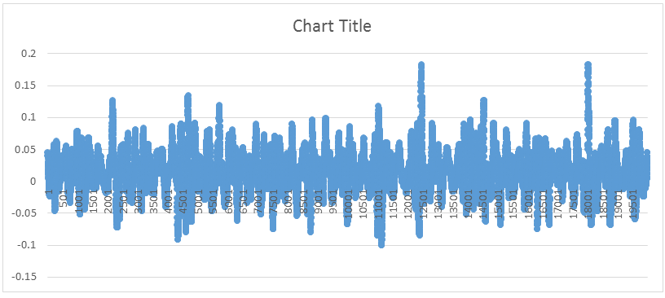
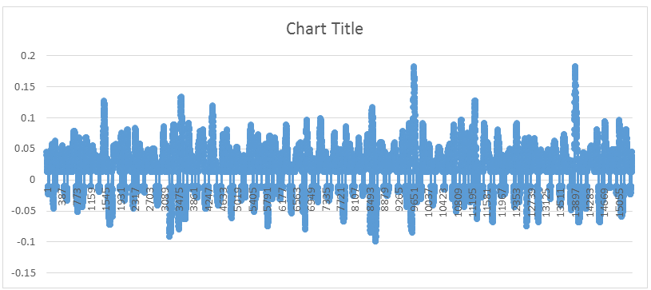
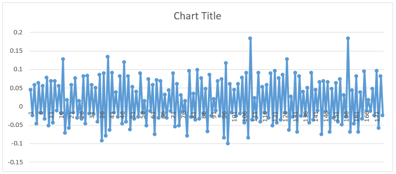
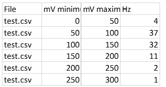

# spikeAnalyser

## What it is
spikeAnalyser is a short program written in Python 3 which will examine a folder of .csv files and do the laborious job 
of measuring the amplitudes (heights) of the spikes. Normally you would do this manually by creating a graph for each 
.csv file (using all 20,000 data points) and then using the cursor to find the values at the top and bottom of each 
spike. Adding the magnitude of these two values gives the height of a spike and this would be done for each spike in 
each file you analysed.

The program does this for you and produces a summary of the number of spikes of each height in each .csv file in the 
folder.

## How to use it
Download [spikeAnalyser_v2.zip](https://github.com/mjaquiery/spikeAnalyser/raw/master/spikeAnalyser_v2.zip) and extract 
it to a sensible location.

Run spikeAnalyser_v2.exe located in the dist folder (.../spikeAnalyser_v2/dist/spikeAnalyser_v2.exe). Follow the 
onscreen instructions.

## How it works
The program does the following for each file specified:
* Process the file and store the raw values therein. If you were to make a graph of the file at this point you would get
 the graph you would normally be analysing
            
* Next, the program strips out all of the data which is below the thresholds given. Since the data can be very noisy 
close to the x-axis origin this noise-reduction does make the data for the lowest bin (0-50mV by default) unreliable. 
This is considered acceptable since attempting to extract this data manually is essentially equally vulnerable to the 
noise. A graph of the above data processed to this point is shown below
            
* The next step replicates the first part of the job a human needs to do: find the high and low points. The program 
removes all other points from the file. The graph of this stage would look as below
            
* The first graph had 20,000 points. The second (in this example) around 15,000. The third graph has just 174 points 
representing the high and low point of 87 spikes. The last stage of the program is to measure the amplitude of these 
spikes and then count the number of spikes within each amplitude range. Since the number of spikes is a frequency (a 
number in a given time) it is reported as Hz, and since each .csv file represents a single second the number counted 
exactly equals the frequency measured in Hz. The summary for a single file looks like this
            
  
## The output file
When you open your output file you will see a long table with 4 columns (the columns are shown in the image above). The 
file column is the name of the file the results of that column belong to. The mV minimum and mV maximum fields specify 
the 'bin' into which the amplitudes counted fall. The Hz column tells you how many spikes with amplitudes between the 
values in the previous two columns occurred in that file.

Files which produced no spikes after noise control (possible for data at low levels of force) are not included in the 
output file.

Please note that this data is <strong>not</strong> in the format you need to answer the question the experiment seeks 
to answer. This is because a key piece of information, the Newtons of force generated, is unavailable from the .csv 
files themselves. Hopefully you all named your files sensibly, however, and the Newtons are shown somewhere in the File 
field.<

Rearranging your data to conduct the final analysis is a task the program cannot accomplish so that is left for you to 
do.

**Please note:** the lowest bins are very susceptible to the noise in the data. You should look carefully at the data 
in the lower bins and decide for yourself if they represent signal or noise. These data are not required to answer 
either of the main questions of the experiment since the other bins should provide sufficient data of the necessary 
kind.

## Further information
If you have any queries or concerns contact Guy Richardson or me 
([matt.jaquiery@psy.ox.ac.uk](mailto:matt.jaquiery@psy.ox.ac.uk)).

Matt Jaquiery, 2015